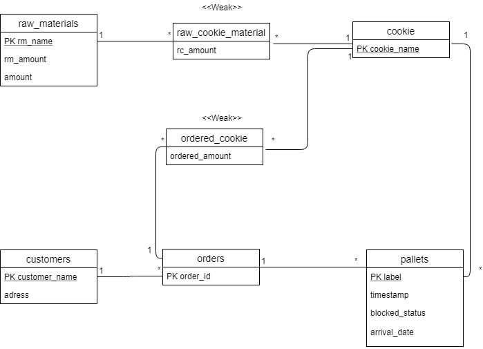

# EDAF75, project report

This is the report for

 + Björn Gummesson, `dat14bgu`
 + Kasper Brinkestam `mat14kbr`

We solved this project on our own, except for:

 + The Peer-review meeting
 + Code from lab 3
 + www.w3schools.com


## ER-design

The model is in the file [`UML_DIAGRAM.png`](UML_DIAGRAM.png):

<center>
    
</center>


## Relations

The ER-model above gives the following relations:

+ raw_materials(**rm_name**, amount)
+ raw_cookie_material(**_cookie_name_**,**_rm_name_**, raw_cookie_amount)
+ cookies(**cookie_name**)
+ orderd_cookie(**_cookie_name_**,**_order_id_**, ordered_amount)
+ pallets(**label**, _cookie_name, _order_id_, timestamp, blocked_status, arrival_Date)
+ orders(**order_id**, _company_name_)
+ customers(**customer_name**, adress)


## Scripts to set up database

The scripts used to set up and populate the database are in:

 + [`create-schema.sql`](create-schema.sql) (defines the tables), and
 + [`initial-data.sql`](initial-data.sql) (inserts data).

So, to create and initialize the database, we run:

```shell
sqlite3 kakor.db < create-schema.sql
sqlite3 kakor.db < initial-data.sql
```


## How to compile and run the program

```shell
java -jar DatabasProjekt.jar
```
Date formats are excpected to be on the format "yyyy-mm-dd", when searching for pallets created between two dates the search entry is expected to be on the same format. 
e.g  2018-02-24:2018-02-25